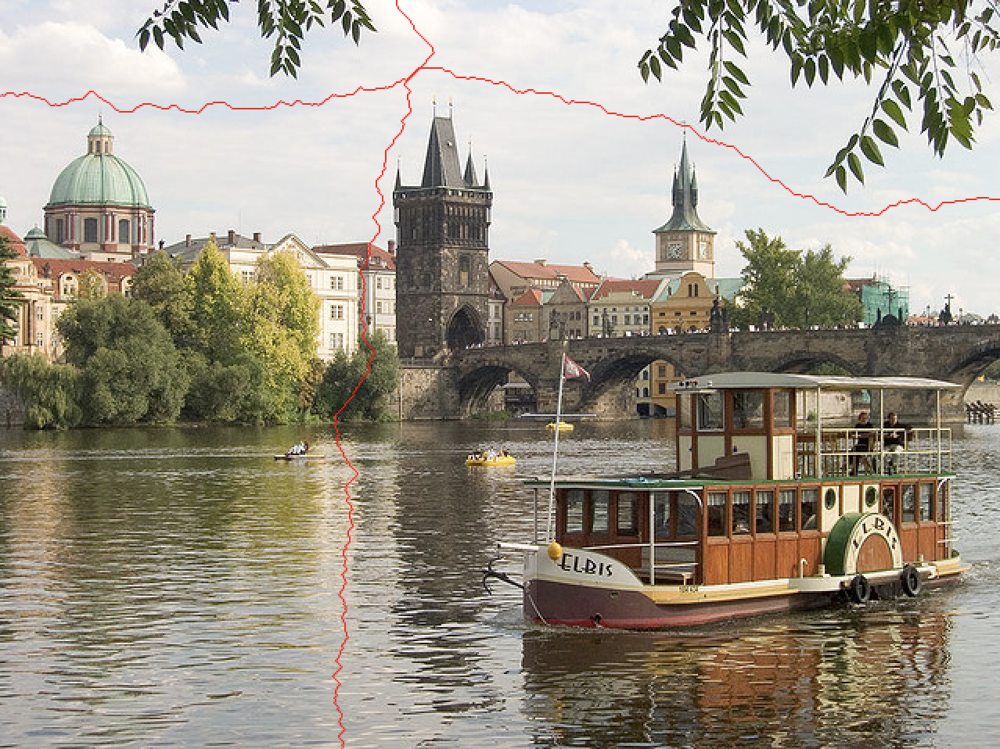
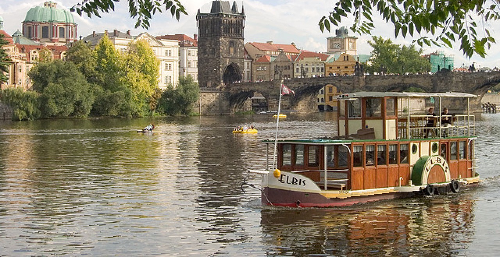

# Seam Carving - 내용을 인식하는 이미지 크기 조절

  

연구 논문: [Seam Carving for Content-Aware Image Resizing](imgs/seam_carving_paper.pdf)

## Seam Carving이란?

Seam이란 이미지에서 가장 흥미롭지 않은 줄을 의미합니다 (빨간줄). 이미지 크기를 조절할때 이 seam을 없에는 것을 seam carving이라고 합니다.

## 결과

### 원본

640 x 480

### 일반적인 크기 조절

640 x 330

### Seam carving을 이용한 크기 조절

640 x 330

일반적인 방식으로 높이를 줄었을 때에는, 보트의 높이가 원본에 비해서 납작해집니다.

하지만, 크기 조절에 seam carving을 사용하면 보트의 크기와 비율이 원본이랑 비슷합니다.

## 실행하는 법

`pip3 install -r requirements.txt` 커멘드를 먼저 실행해서 필요한 패키지를 설치하세요.

`python seam_carving.py -im <이미지 경로> -out <출력 이미지 이름> -dw <너비에 추가/제거할 픽셀 개수> -dh <높이에 추가/제거할 픽셀 개수>`

### 예시

`python seam_carving.py -im imgs/sample.jpg -out output.png -dw 25 -dh -50`

* `sample.jpg` 너비에 25픽셀을 추가하고 높이에 50픽셀을 제거합니다. 새로운 이미지를 `output.png`에 저장합니다.
